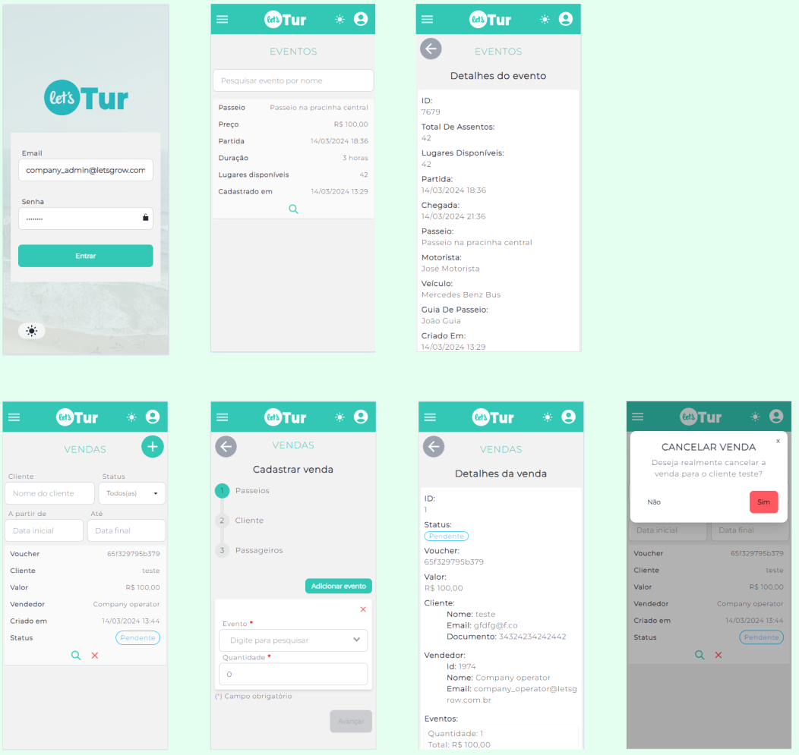
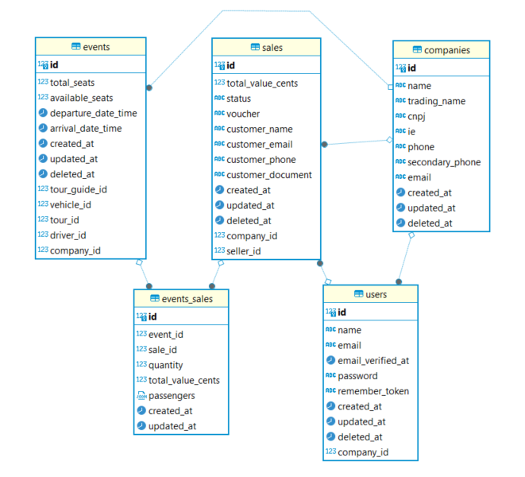

# Letstur (Vendas)

## Sobre o app
O aplicativo de vendas do Letstur é uma das aplicações do Letstur, sistema de controle de agências de passeios turísticos. O seu foco inicialmente é nos operadores das agências contratantes do serviço. Através do aplicativo de vendas, será possível visualizar eventos próximos e realizar vendas de vouchers para os eventos.

## Como rodar o projeto

Primeiramente, se você ainda não tem o Node e Yarn instalados, acompanhe o [tutorial de instalação](https://docs.google.com/document/d/19-0HcZK2Jd_CDPh7jDLcqdaBCVfxMNwam1U8Sbfv5aw/edit).

Clone o repositório atual. Se você não sabe como fazer isso, acompanhe o [tutorial oficial](https://docs.github.com/pt/repositories/creating-and-managing-repositories/cloning-a-repository) do GitHub.

Em um terminal, na pasta do respositório clonado, rode o seguintes comandos:

```bash
$> cd project/

// Se você usa android
$> yarn android

// Se você usa IOS
$> yarn ios
```

## Funcionalidades
- [x] Autenticação (Login de operadores cadastrados via admin)
- [x] Visualização de eventos próximos e seus detalhes
- [x] Visualização de vendas feitas pelo operador autenticado
- [x] Cadastro de vendas de vouchers para eventos
- [x] Cancelamento de venda não confirmada via admin

## Protótipos de tela



## Modelagem do banco de dados



## Planejamento

| Atividade | Tempo previsto | Data limite |
| ----------- | ----------- | ----------- |
| Configuração de roteamento     | 3 dias      | 28/04/2024 |
| Configuração de middlewares de autenticação    | 3 dias      | 28/04/2024 |
| Instalação e configurações de bibliotecas     | 2 dias      | 28/04/2024 |
| Área de autenticação    | 1 semana      | 26/05/2024 |
| Listagem de eventos próximos    | 4 dias     | 26/05/2024 |
| Visualização de detalhes de um evento    | 1 dia      | 26/05/2024 |
| Listagem de vendas do usuário    | 4 dias    | 26/05/2024 |
| Visualização de detalhes de vendas    | 1 dia     | 26/05/2024 |
| Cancelamento de venda ainda não confirmada    | 1 dias      | 26/05/2024 |
| Formulário de vendas    | 2 semanas      |16/06/2024 |

## Atividades
- [x] Configuração Expo Router
- [x] Configuração Eslint
- [x] Configuração React Native Elements
- [x] Configuração NativeWind
- [x] Implementação do layout da área de autenticação (Stack)
- [x] Implementação da interface estática de login
- [x] Implementação do layout da área autenticada (Drawer)
- [x] Implementação da interface estática de eventos (Listagem + detalhes)
- [x] Implementação da interface estática de vendas (Listagem + detalhes + criação de vendas)
- [x] Implementação da lógica de autenticação
- [x] Implementação da l[ogica de eventos
- [x] Implementação da lógica de vendas
